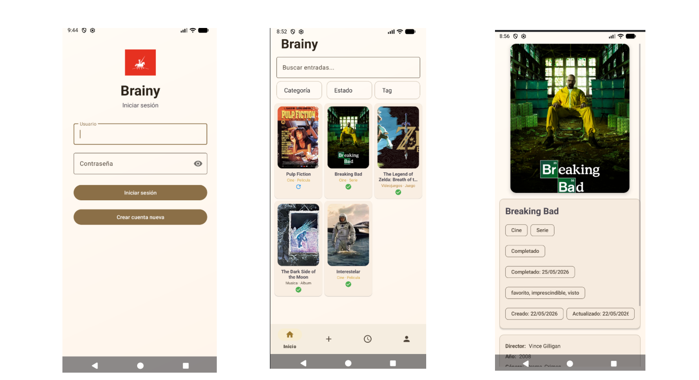
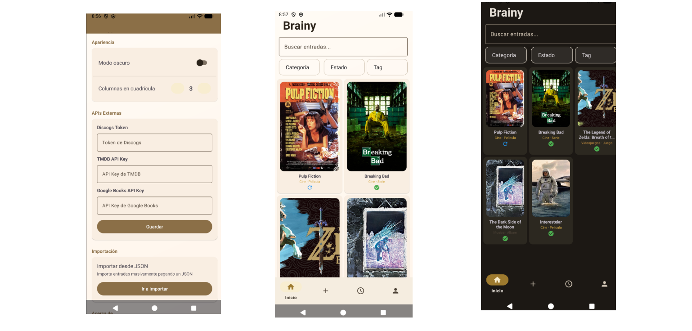
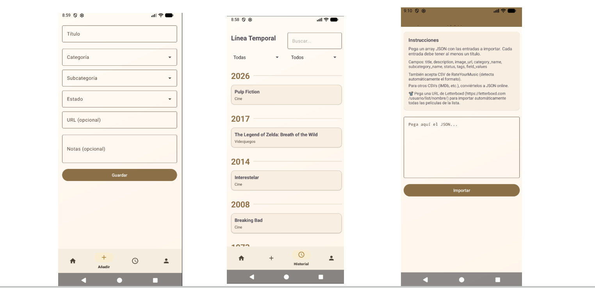

# Brainy

Brainy es una app Android para gestionar un registro cultural personal. Sirve para llevar un seguimiento de peliculas, series, musica, libros, videojuegos, arte y personas.

La app se conecta a un backend Django REST API que se encarga de la persistencia de datos y la logica de negocio.

> Importante: La app necesita que el backend este corriendo para funcionar. Sin el servidor, no carga datos.

## Capturas de pantalla

## Como compilar

1. Abre el proyecto en Android Studio
2. Sincroniza Gradle (File > Sync Project with Gradle Files)
3. Conecta un dispositivo o inicia un emulador
4. Dale a Run

## Configuracion del backend

La app intenta conectarse automaticamente a varias IPs locales. Por defecto prueba estas direcciones:

- `http://10.0.2.2:8000/` (emulador Android > localhost)
- `http://192.168.1.XXX:8000/` (red local)

Si tu backend corre en otro puerto o IP, puedes cambiarlo en `ApiClient.java`.

El codigo del backend esta en: [github.com/MLopezG25/Brainy](https://github.com/MLopezG25/Brainy)

## Funcionalidades principales

- Registro e inicio de sesion de usuarios
- Timeline para visualizar entradas por año
- Formulario de entrada para añadir pelis, series, libros, etc.
- Perfil con estadisticas y ajustes
- Importacion de datos desde archivos
- Compartir contenido desde otras apps

## Tecnologias

- Java como lenguaje principal
- Retrofit para el cliente HTTP
- Gson para el parseo de JSON
- ViewBinding para el binding de vistas
- Material Design para la interfaz de usuario

## Licencia

Uso personal y educativo.
